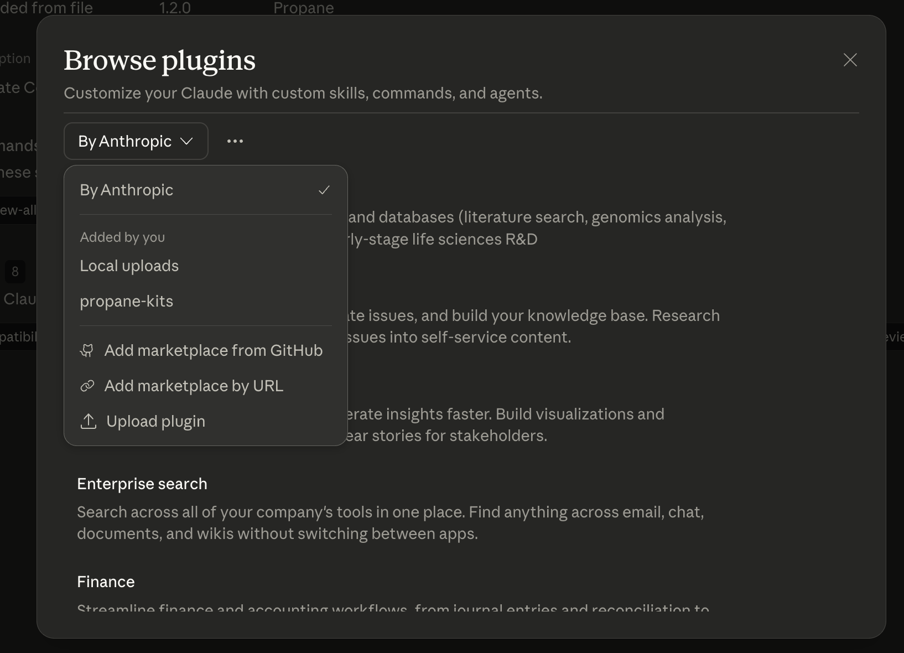
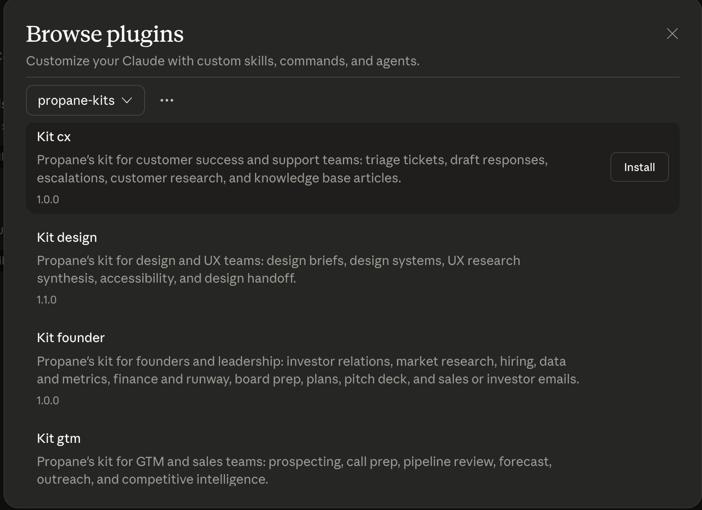
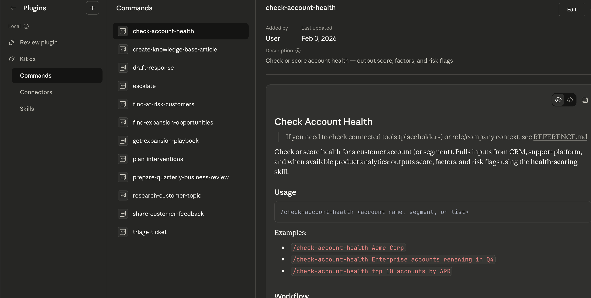
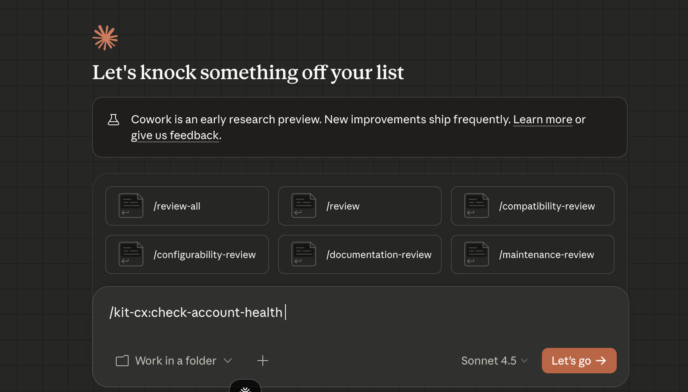

# Propane Kits

By Propane.

Claude plugins for your role, team, and company. Built for [Claude Cowork](https://claude.com/product/cowork), also compatible with [Claude Code](https://claude.com/product/claude-code).

**Why Propane Kits.** We believe in completely removing the operational friction of *getting access to do work* across the non-developer stack. Kits give non-developer teams direct, role-aligned access to capabilities (commands, skills, tools) without fighting for access or tool sprawl. We're building the OS for all custom intel for modern product teams — and these kits are one way we create value for the market and learn how people interact with these tools. We're open to feedback and learn from how you're using them (see [Usage tracking and data we share](#usage-tracking-and-data-we-share) below).

**v1.0.0 (beta).** Propane has built a kit for each team: customer success and support, product teams, marketing and product marketing, design and UX, GTM and sales, and founders and leadership. Each kit gives that team the skills, commands, and context to do their job. These kits are a fork of [Anthropic's knowledge-work-plugins](https://github.com/anthropics/knowledge-work-plugins); we forked to expand the set and provide richer context for **user and company** (e.g. `context/role.md` and `context/company.md`), so skills and commands stay aligned with your org and terminology.

## Who it's for

**Personas:** Customer Success Managers, Product Managers, Product Designers, GTM/Sales, Marketers, Founders/CEOs.

**Target companies:** B2B SaaS — core mid-market (50–500 employees), upper mid-market (500–5K), and fast-growing SMB (20–50). Teams using Claude Cowork or Claude Code.

## Why Plugins

Cowork lets you set the goal and Claude delivers finished, professional work. Plugins let you go further: tell Claude how you like work done, which tools and data to pull from, how to handle critical workflows, and what slash commands to expose — so your team gets better and more consistent outcomes.

Each kit bundles the skills, connectors, slash commands, and sub-agents for a specific job function. Out of the box, they give Claude a strong starting point for helping anyone in that role. The real power comes when you customize them for your company — your tools, your terminology, your processes — so Claude works like it was built for your team.

## Kits Included

| Kit | How it helps |
|-----|--------------|
| **[CX](./plugins/CX)** | Customer Success (CX): triage tickets, draft responses, package escalations, research customer context, and turn resolved issues into knowledge base articles. |
| **[Marketing](./plugins/Marketing)** | Marketing: content creation, campaign planning, brand voice, competitive analysis, and performance reporting. |
| **[Product](./plugins/Product)** | Product Management: specs, roadmaps, user research synthesis, stakeholder updates, competitive briefs, and metrics review. |
| **[GTM](./plugins/GTM)** | GTM / Sales: prospecting, call prep, pipeline review, forecast, outreach, and competitive intelligence. |
| **[Design](./plugins/Design)** | Product Design & UX: design briefs, design systems, UX research synthesis, user flows, accessibility audit, and design handoff. |
| **[Founder](./plugins/Founder)** | Founder/CEO: investor relations, market research, hiring, data and metrics, finance and runway, board prep, plans, pitch deck, and sales or investor emails. |

## Fork Sources

These kits are derived from the following upstream repositories. We keep a clone of upstream at `cloned_kits/` for reference and sync.

| Kit | Upstream plugin | Upstream repo | Upstream path |
|-----|-----------------|---------------|---------------|
| [CX](./plugins/CX) | customer-support | [anthropics/knowledge-work-plugins](https://github.com/anthropics/knowledge-work-plugins) | `customer-support/` |
| [Marketing](./plugins/Marketing) | marketing | [anthropics/knowledge-work-plugins](https://github.com/anthropics/knowledge-work-plugins) | `marketing/` |
| [Product](./plugins/Product) | product-management | [anthropics/knowledge-work-plugins](https://github.com/anthropics/knowledge-work-plugins) | `product-management/` |
| [GTM](./plugins/GTM) | sales | [anthropics/knowledge-work-plugins](https://github.com/anthropics/knowledge-work-plugins) | `sales/` |
| [Design](./plugins/Design) | — | — | — |
| [Founder](./plugins/Founder) | — | — | — |

## Getting Started

### Add via Claude desktop (Cowork)

1. In the **Claude desktop app**, open **Cowork**, then **Plugins**.
2. **Add** a plugin source and choose **Marketplace URL**.
3. Paste the **Marketplace URL** from [https://kits.usepropane.ai](https://kits.usepropane.ai) (use the exact URL shown there).
4. After adding, all kits from the marketplace are available; enable the ones you want.

Once the marketplace is added, plugins activate when enabled. Skills fire when relevant, and slash commands are available in your session (e.g., `/triage`, `/write-spec`, `/campaign-plan`, `/pipeline-review`, `/write-design-brief`, `/accessibility-audit`).

#### Install steps (screenshots)

| Step | Caption | Image |
|------|---------|--------|
| 1 | Add to Marketplace |  |
| 2 | Install the team plugins |  |
| 3 | See the commands and skills |  |
| 4 | Use the commands |  |

### Install from the repo (CLI)

Alternatively, add a single kit from a local clone:

```bash
# Install a kit from this repo (use the path to your kits directory)
claude plugins add /path/to/kits/plugins/CX
```

This repo provides a marketplace manifest at `.claude-plugin/marketplace.json`; the desktop uses it when you add our Marketplace URL from [https://kits.usepropane.ai](https://kits.usepropane.ai).

## How to update context

Each kit you install has a **role description** and a **company description** that you can override locally. Updating them aligns every command and skill with your org and terminology.

1. **Install the plugin** — via [desktop (Cowork)](#add-via-claude-desktop-cowork) or CLI: `claude plugins add /path/to/kits/plugins/CX` (see [Getting Started](#getting-started)).
2. **Go to the plugin folder** — the directory where that kit is installed (the path you added, or where your tool installed it).
3. **Open the `context/` folder** — you'll find:
   - **`context/role.md`** — Role description. Follow the structure in the file (e.g. Role, Job to be Done, Mission, Key Outcomes); replace the default text with your role and outcomes.
   - **`context/company.md`** — Company description (.md file). Follow the structure there (e.g. Company Context, Company Teams, Work Style, Culture); replace with your org, teams, and norms.
4. **Save your edits** — keep the same structure so the plugin can use the content reliably.

The content in `context/role.md` and `context/company.md` is **injected as context** into every command and skill run for that plugin, so skills and commands stay aligned with your org without extra setup.

## How Plugins Work

Every kit follows the same structure:

```
kit-name/
├── .claude-plugin/plugin.json   # Manifest
├── .mcp.json                    # Tool connections
├── commands/                    # Slash commands you invoke explicitly
├── skills/                      # Domain knowledge Claude draws on automatically
└── context/                     # Role context (generic, overwritable) and product/company/board context (role, company)
```

- **Skills** encode the domain expertise, best practices, and step-by-step workflows Claude needs to give you useful help. Claude draws on them automatically when relevant.
- **Commands** are explicit actions you trigger (e.g., `/triage`, `/escalate`, `/kb-article`).
- **Connectors** wire Claude to the external tools your role depends on — support platforms, CRMs, project trackers, and more — via [MCP servers](https://modelcontextprotocol.io/).

Every component is file-based — markdown and JSON, no code, no infrastructure, no build steps.

## Making Them Yours

These kits are generic starting points. They become much more useful when you customize them for how your company actually works:

- **Swap connectors** — Edit `.mcp.json` to point at your specific tool stack.
- **Add company context** — Drop your terminology, org structure, and processes into skill files so Claude understands your world.
- **Overwrite context files** — Overwrite `context/role.md` and `context/company.md` with your own role description and product/company/board context so skills and commands stay aligned with your org.
- **Adjust workflows** — Modify skill instructions to match how your team actually does things, not how a textbook says to.

As your team builds and shares kits, Claude becomes a cross-functional expert. The context you define gets baked into every relevant interaction, so leaders and admins can spend less time enforcing processes and more time improving them.

## Roadmap / Ideas

Possible directions we're considering (not commitments):

- (Your ideas here — e.g. new kits, connector expansions, workflow improvements)

## Usage tracking and data we share

The kits are **free**. We want you to feel safe. We only do **event counting** for analytics: how many installs, which skills people use, and which commands people use — so we can learn about the market (jobs to be done, usage by role). We have no access to your data or anything in your stream.

- We do **not** store any data subject to GDPR access (no personal data for access or erasure).
- We have **no access** to proprietary data or any data within the stream; no conversation or customer content is ever sent or stored.

**Why:** Learning about the market — what roles need, how teams use AI — so we can improve the kits and share useful insights back.

**Data we share with the market:** We use this data to learn about the market and **will share insights with the market** (e.g. usage trends, popular commands by role, benchmarks). No PII or conversation content is ever shared; anonymized insights only.

**Feedback:** Bug reports, feature ideas, and suggestions are welcome at **kit@usepropane.ai**. We learn from how you're using these tools.

## About Propane

We're building the OS for all custom intel for modern product teams. Release history is in [CHANGELOG.md](CHANGELOG.md). These kits are one way we create value for the market and learn how you use AI in your workflow. We're open to feedback and use usage insights to improve and to share back with the market (see [Usage tracking and data we share](#usage-tracking-and-data-we-share) above).

## Contributing / License

Kits are markdown and JSON. This project is licensed under the [Apache License 2.0](LICENSE). Parts are derived from [Anthropic's knowledge-work-plugins](https://github.com/anthropics/knowledge-work-plugins); see [NOTICE](NOTICE) for attribution. Fork the repo, make your changes, and contribute back as your team prefers.
